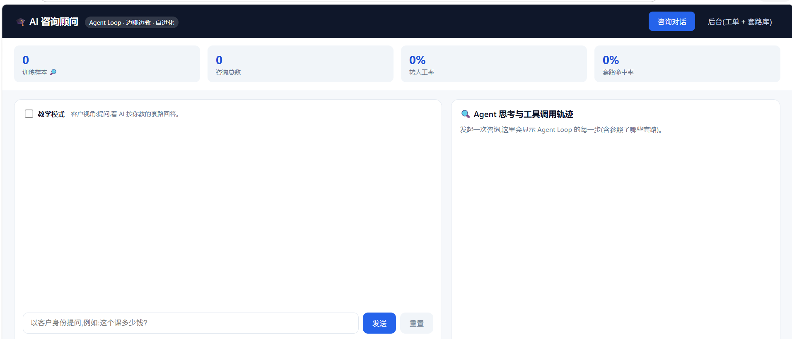

一个"麻雀虽小五脏俱全"的电商客服 Demo

1. **Agent Loop**:模型在"推理 → 选工具 → 调用 → 观察 → 再决策 → 收尾"的循环中,自主选择商品检索 / 知识库 RAG / 订单查询 / 转人工等工具,带边界控制与轨迹可视化。
2. **自纠错 / 自进化闭环**:答不上的问题自动转人工 → 人工补充答案 → 审核入库 → 同一问题下次自动答对;知识库随使用增长、转人工率下降。

> 大模型用可替换的 **Mock 桩**(离线、可重复演示),换成真实模型只需实现 `LLMProvider.chat()`。

## 快速开始

```bash
cd ai-customer-service
pip install -r requirements.txt
python run.py
```

浏览器打开 http://127.0.0.1:8000

## 演示流程

1. 聊天页问商品参数 / 订单 → 看右侧 **Agent 轨迹**(自主选工具)。
2. 问"扫地机器人 X1 能翻越多高的门槛?" → **自动转人工**。
3. 切到"后台审核" → 给工单填答案 → 审核队列点"通过并入库"。
4. 回聊天页再问同一问题 → **直接答对**(自纠错生效)。
5. 看顶部看板:知识库条目数↑、转人工率↓(自进化量化)。

## 目录结构

核心:

- `app/agent/loop.py` —— Agent Loop 引擎
- `app/agent/tools/` —— 工具集
- `app/llm/` —— LLM 抽象与 Mock
- `app/knowledge/` —— 本地向量知识库
- `app/services/` —— 对话 / 审核闭环
- `static/` —— 聊天页 + 审核台前端

## 换成真实大模型

在 `app/llm/` 下新增一个 `OpenAIProvider(LLMProvider)`,实现 `chat(messages, tools)`,
把 `app/config.py` 的 `LLM_PROVIDER` 改成对应值即可,Loop 与工具无需改动。
